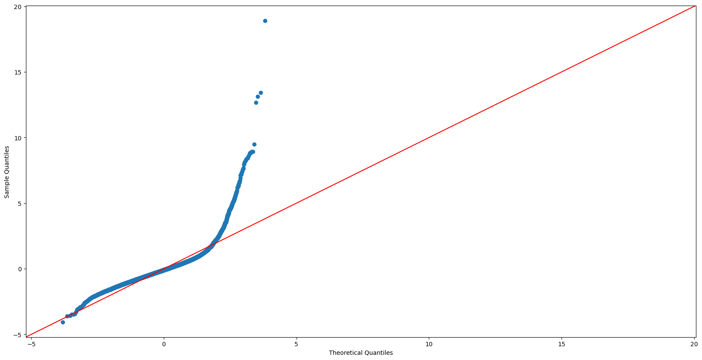
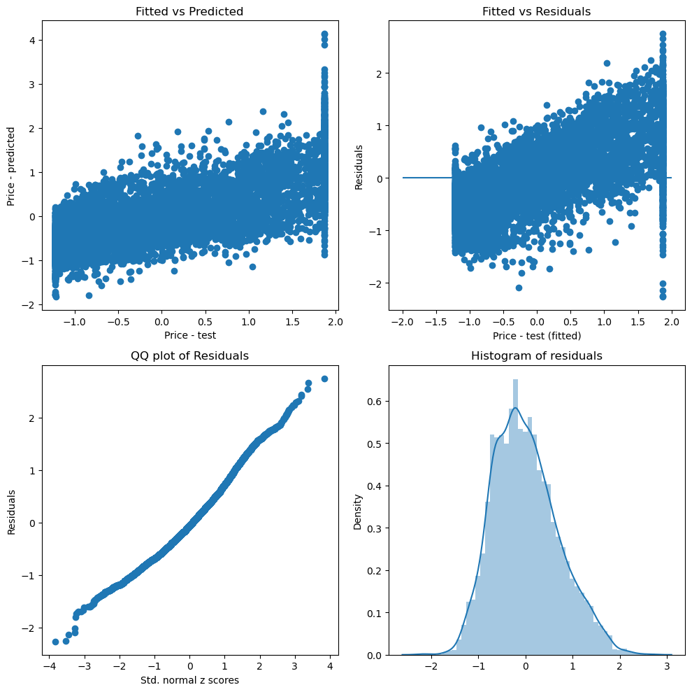
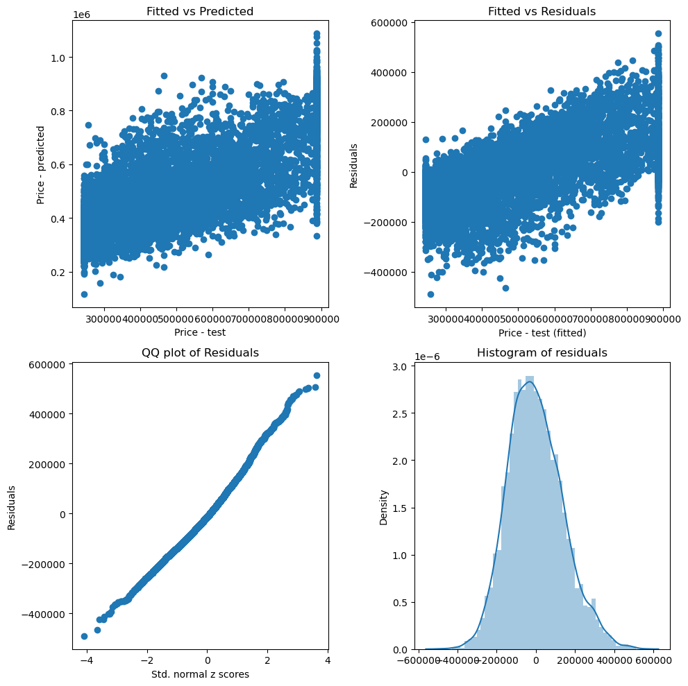

# Real_estate project
 Analysis of King County real estate data

Author: Tisa Yip

## Overview

Regression analysis of King County Real Estate data to predict house prices.

## Business Problem

This information could be used by real estate agencies to evaluate what a property could be currently sold at within King County.

## Data Understanding

The data used in this analysis is from King County.  This dataset contains relevant information recent homes sold and their details so there are a good set of variables to base the models on.

## Data Modeling

<li>Linear regression was used to model first, the raw data.</li>

 
<li>Next, the data was scaled to a normal distribution.</li>

 
<li>Lastly, dummy variables were added and log transformation done.</li>

## Evaluation
From the raw data sqft_living and grade correlate highly with price. Sqft_living slightly more than grade.

Once the data is scaled it shows grade has more influence on the price than sqft_living.

MSE for scaled data is 0.8 difference train/test and the MSE for log data is 0.96 which shows that the scaled data produced a slightly more accurate predictor model than the log transformation.

## Conclusions
 We thoroughly inspected the model parameters, vetted that assumptions hold good.</li>
<li> The accuracy of the models did not increase much after scaling. </li>
<li> They may not be the best when it comes to accurate predictions, however they help us answer basic questions better, such as "which characteristics influence the cost of a home, is it how much square footage or the grade which King County assign to a property"?. In this case it's the grade by a fraction.</li>

## For More Information
See the full analysis in the <a href="Project2_Final.ipynb">Jupyter Notebook</a> or review this <a href="King_County_Presentation.pdf">presentation.</a>

For additional info, contact Tisa Yip at 
<a href="mailto:clawspawsandjaws@gmail.com"> clawspawsandjaws@gmail.com </a>
